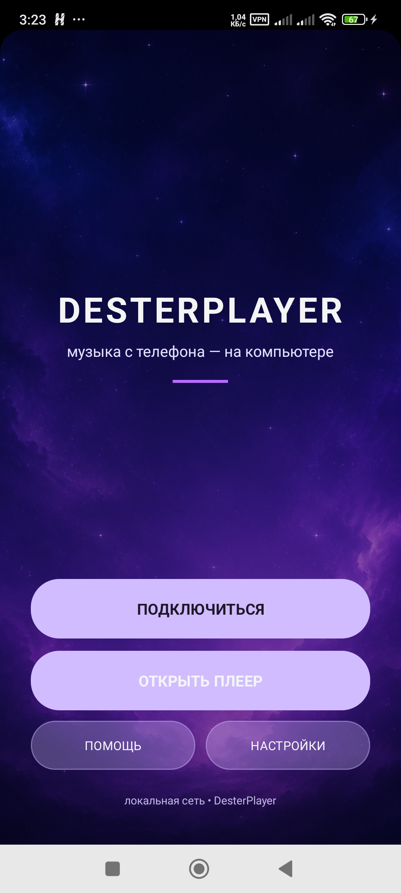
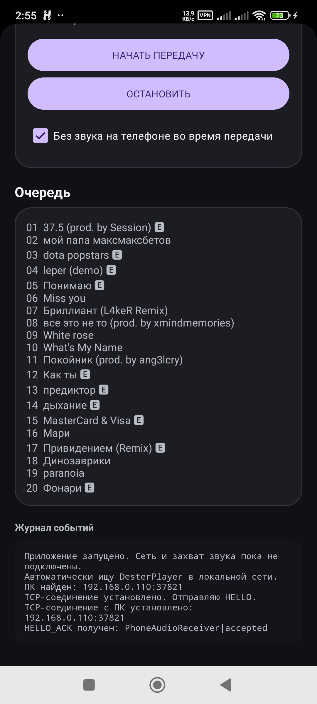

# DesterPlayer

DesterPlayer передаёт звук с Android-телефона на компьютер по локальной Wi‑Fi сети. Приложение также показывает текущий трек, исполнителя, обложку и очередь музыки.

## Возможности

- автоматический поиск DesterPlayer на ПК;
- передача звука в PCM 48 kHz, stereo, 16-bit;
- отключение звука на телефоне во время передачи с восстановлением громкости;
- название трека, исполнитель, обложка и очередь;
- управление музыкой с ПК: назад, play/pause, дальше и выбор трека;
- отдельная громкость приложения на Windows;
- стартовое меню и единый дизайн телефона и ПК.

## Требования

- Android 10 или новее;
- телефон и компьютер в одной Wi‑Fi сети;
- запущенное приложение DesterPlayer на Windows;
- для названий треков и обложек — доступ к уведомлениям.

## Установка APK

1. Скачайте APK из раздела **Releases** на GitHub.
2. Откройте APK на телефоне.
3. Разрешите установку из этого источника, если Android попросит.
4. Запустите DesterPlayer.

## Подключение

1. Запустите DesterPlayer на ПК.
2. Откройте приложение на телефоне и нажмите **Подключиться**.
3. Нажмите **Найти ПК** — компьютер должен определиться автоматически.
4. Нажмите **Начать передачу**.
5. Подтвердите системное разрешение на захват звука.

Если ПК не находится автоматически, проверьте, что оба устройства подключены к одной сети и Windows Firewall разрешает DesterPlayer работать в локальной сети.

## Разрешения

- **Запись аудио** — требуется Android для захвата воспроизводимого звука.
- **Захват экрана/аудио** — системное разрешение MediaProjection для передачи звука приложений.
- **Уведомления** — нужны для фоновой работы и статуса передачи.
- **Доступ к уведомлениям** — необязателен, но нужен для названия трека, исполнителя и обложки.
- **Интернет** — используется только для локального TCP/UDP соединения с ПК; внешний сервер для передачи звука не нужен.

## Сборка

Debug APK:

```text
gradlew.bat :app:assembleDebug
```

Для публикации рекомендуется использовать Android Studio:

**Build → Generate Signed App Bundle or APK → APK → Create new keystore**.

Файл ключа и пароль от него нельзя добавлять в GitHub. Сохраняйте их отдельно — без ключа нельзя выпускать обновления того же приложения.

## Скриншоты

Скриншоты находятся в папке [`docs/screenshots`](docs/screenshots).





## Лицензия

Проект находится в разработке. Лицензия будет добавлена перед публичным релизом.
